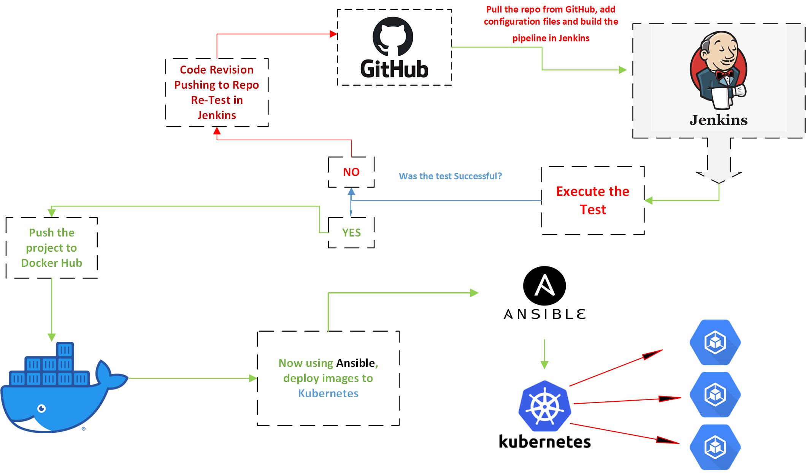

❗ Project Capstone. Instruction to [follow](https://docs.google.com/document/d/17OwlITE-yPWNj3Vi5RtQfz3ItvSkOfnbaVMnzlZyGTg)

# Project Capstone - Part I. 

## 🔥 Project Brief Overview:
Building a Docker Jenkins Pipeline, Testing Application, Pushing to Docker Hub, and Deploying to Kubernetes 
- **When** using Jenkins, we need to install Docker for specific OS. In my case, I install Docker on Kali Linux(Debian)
- **Then** pull the Jenkins image and deploy it on Docker, we will create Dockerized Jenkins.
- **Then** install necessary Jenkins Plugins:
```
• Ansible
• Docker
• Docker Pipeline
• CloudBees Docker Custom Build Environment
• Python
• Shining Panda
```
- **Then** add Docker Hub credentials to push the image after build will be tested in Jenkins.
- **And** image will be pushed to Docker Hub. _Kubernetes.yaml_ file is required to pull image from DockerHub and create 5 pods in Kubernetes.

## 📌 Must Have
- The following file are must have in order to achieve the results: **Dockerfile,** **Jenkinsfile,** **kubernetes.yaml,** **Ansible-Playboo.yaml**
- **Optional** to have _**yaml**_ file with necessary commands which will run and install all dependencies automatically.

## ❗ Visual overview of Project
